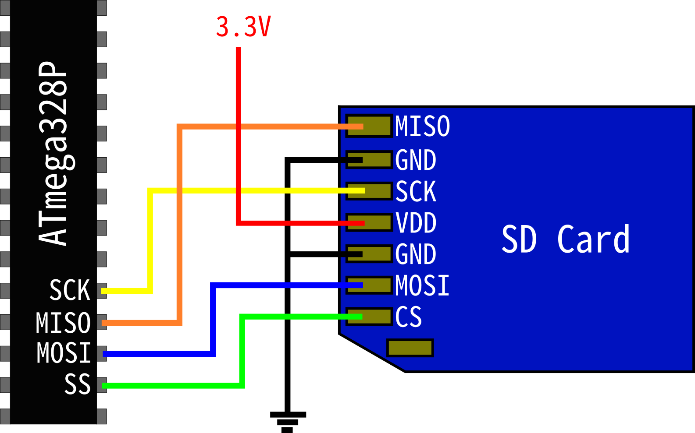

## E203-SD-FatFs
适用于 [hbird-sdk](https://github.com/riscv-mcu/hbird-sdk) 的 SD 卡 SPI 模式驱动及 FatFs 文件系统移植。

可在蜂鸟 RISC-V 处理器 [E203](https://github.com/riscv-mcu/e203_hbirdv2) 上借助 SPI 外设实现对 FAT32 格式 SD 卡进行读写。

### 移植清单
#### 格式支持
- [x] FAT32
- [ ] exFAT

#### FatFs Application Interface
- [x] f_open
- [x] f_close
- [x] f_read
- [ ] f_write
- [x] f_mount
- [x] f_close

#### FatFs Media Access Interface
- [x] disk_status
- [x] disk_initialize
- [x] disk_read
- [x] disk_write

#### SD Card Driver
- [x] sd_goIdleState
- [x] sd_init
- [x] sd_sendCmd
- [x] sd_readSingleBlock
- [ ] sd_writeSingleBlock
- [ ] sd_readMultiBlock
- [ ] sd_writeMultiBlock
- [ ] sd_stopTransmission
- [x] sd_readRes1 & sd_readRes1b & sd_readRes3_7

#### SPI Driver
- [x] spi_send8 & spi_send16 & spi_send32
- [ ] spi_receive8

### 使用要求
1. 不支持 SD v1.x 卡，只支持 SDHC、SDXC 卡
2. （暂时）卡片格式需为 FAT32
   - 推荐格式化工具：[DiskGenius](https://www.diskgenius.cn/)

### 如何使用
#### 硬件连接

sd_schem form http://rjhcoding.com

| GPIO A [0:31] | SD Card |
| ------------- | ------- |
| VCC 3.3       | VDD     |
| GND           | GND     |
| 8             | SCK     |
| 9             | CS      |
| 10            | MOSI    |
| 11            | MISO    |

E203 GPIO 定义详见 [SW or IOF Configuration](https://doc.nucleisys.com/hbirdv2/soc_peripherals/ips.html#sw-or-iof-configuration)

SD 卡引脚定义详见 [SD MicroSD Card pinout](https://www.electroniccircuitsdesign.com/pinout/sd-microsd-card-pinout.html)

#### 软件编写
> 可直接参考 `src/demo.c`
> 
> 函数定义见：[FatFs - Generic FAT Filesystem Module](http://elm-chan.org/fsw/ff/00index_e.html)

1. 将 src 目录下除 `demo.c` 外文件拷贝至你的工程目录，在 `main.c` 中书写以下代码：
2. 将 GPIOA 的 [8:11] 引脚配置为 SPI1：`gpio_iof_config(GPIOA, (IOF_SPI_MASK | ANY_MASK));`
    - 注意：将引脚配置为 SPI1 的操作不可逆，程序后续不可将 [8:11] 作为 IO 引脚配置使用，详见 e203 sdk 中 [gpio_iof_config](https://github.com/riscv-mcu/hbird-sdk/blob/master/SoC/hbirdv2/Common/Source/Drivers/hbirdv2_gpio.c#L4) 源码
3. 挂载 SD 卡： `f_mount`
4. 打开指定文件： `f_open`
5. 读取文件数据： `f_read`
6. 关闭文件：`f_close`
7. 卸载 SD 卡：`f_unmount`

### 开发平台
ZedBoard + Vivado + NucleiStudio + hbird_sdk@0.1.4

### 参考资源
- [http://rjhcoding.com/avrc-tutorials-home.php](http://rjhcoding.com/avrc-tutorials-home.php)
- [Simplified Specifications | SD Association](https://www.sdcard.org/downloads/pls/)
- [NodeMCU实现SD卡扇区级读写](https://zhou-yuxin.github.io/articles/2016/NodeMCU%E5%AE%9E%E7%8E%B0SD%E5%8D%A1%E6%89%87%E5%8C%BA%E7%BA%A7%E8%AF%BB%E5%86%99/index.html)
- [FatFs - Generic FAT Filesystem Module](http://elm-chan.org/fsw/ff/00index_e.html)
- [Hummingbirdv2 SoC Peripherals](https://doc.nucleisys.com/hbirdv2/soc_peripherals/ips.html#spi)